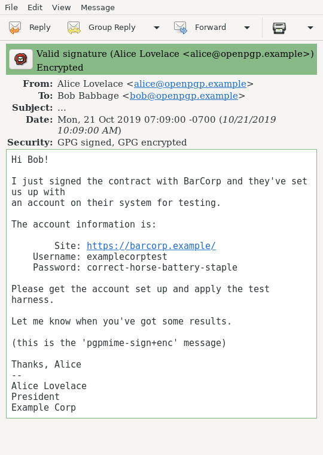
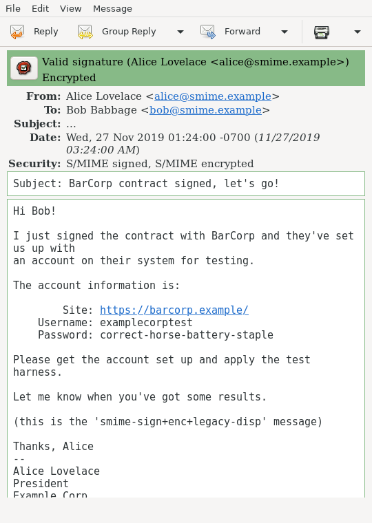

These Evolution screenshots were generated on a Debian
testing/unstable system on amd64, running X11.

~~~
$ dpkg -l evolution
Desired=Unknown/Install/Remove/Purge/Hold
| Status=Not/Inst/Conf-files/Unpacked/halF-conf/Half-inst/trig-aWait/Trig-pend
|/ Err?=(none)/Reinst-required (Status,Err: uppercase=bad)
||/ Name           Version      Architecture Description
+++-==============-============-============-==============================================
ii  evolution      3.34.1-3     amd64        groupware suite with mail client and organizer
~~~

Configuration was simple and straightforward.  No plugins were needed for either S/MIME or OpenPGP.
Certificates and secret keys were loaded from the draft documents.

Samples:

 - `pgpmime-signed`

    

 - `smime-multipart-signed`

    

 - `smime-onepart-signed`

    

 - `pgpmime-sign+enc`

    

 - `smime-sign+enc`

    

 - `pgpmime-sign+enc+legacy-disp`

    

 - `pgpmime-layered`

    

 - `pgpmime-layered+legacy-disp`

    

 - `smime-sign+enc+legacy-disp`

    

 - `smime-enc+legacy-disp`

    

 - `pgpmime-enc+legacy-disp`

    

 - `unfortunately-complex`

    
