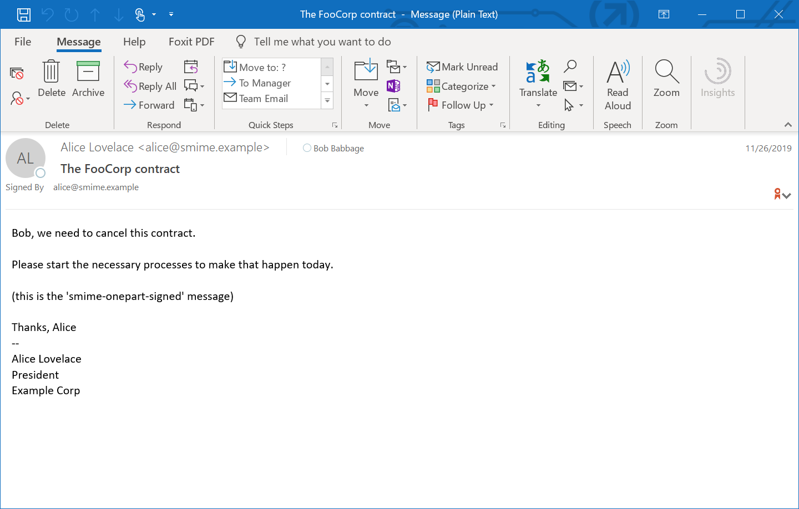
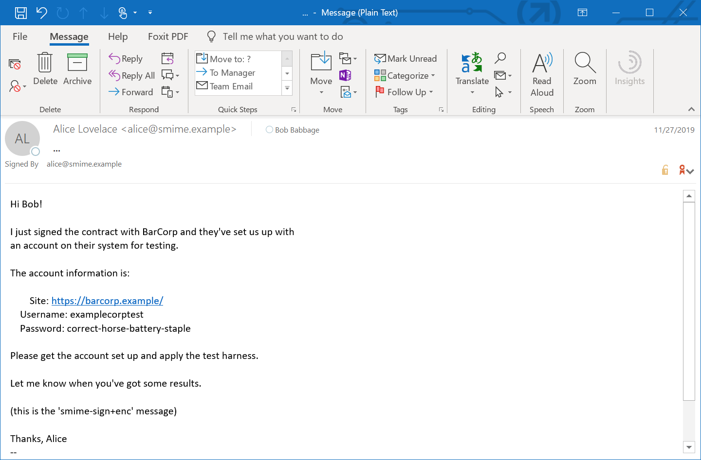
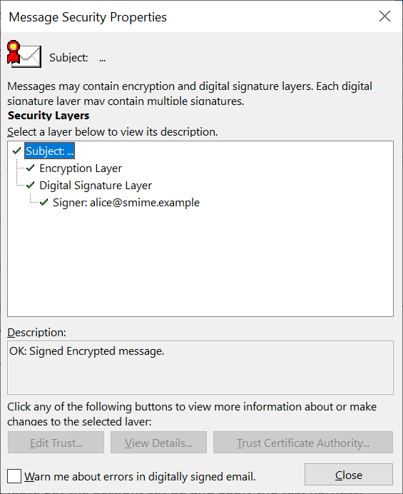
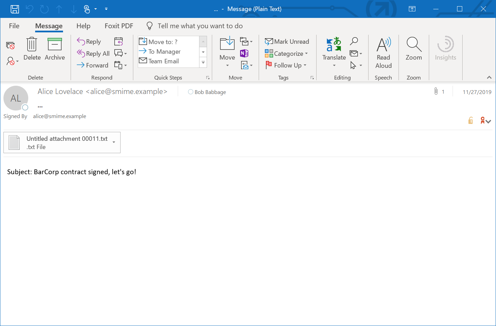
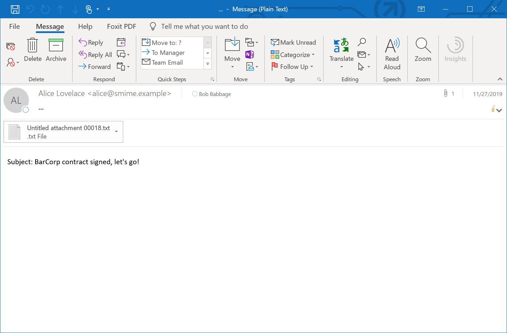
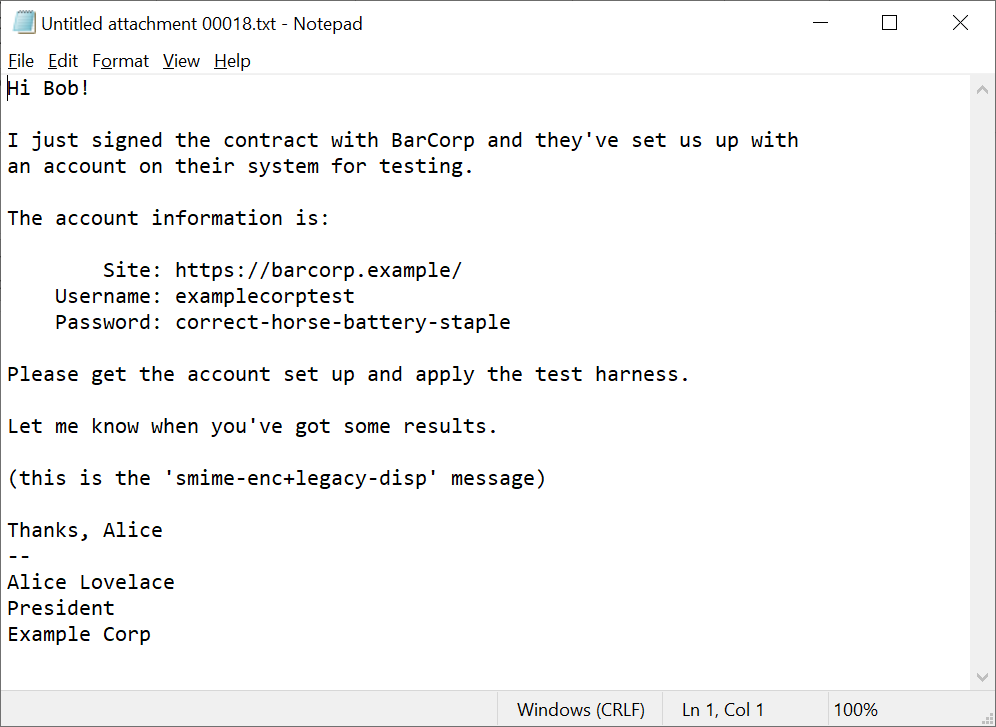

Platform
--------
 - Microsoft Windows 10 Enterprise
 - 10.0.17763 Build 17763
 - 64-bit

Mail User Agent
---------------
Microsoft Outlook for Office 365 MSO (16.0.11425.20214) 64-bit

Entrust Entelligence Security Provider 10.0 for Outlook
Entrust Entelligence Security Provider 10.0 for Windows
Build: 10.0.20.1465

Sample LAMPS Certificate Authority and bob.p12 loaded via Entrust Certificate Manager.

Samples
-------

 - `smime-multipart-signed`

    

 - `smime-onepart-signed`

    

 - `smime-sign+enc`

    Displayed both message and security details

    
    

 - `smime-sign+enc+legacy-disp`
 
    Displayed both message and attachment

    
    

 - `smime-enc+legacy-disp`

    Displayed both message and attachment

    
    

