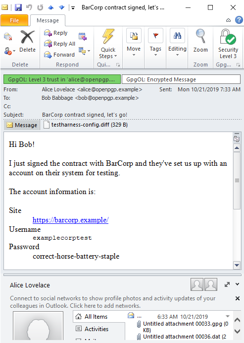

Platform
--------
 - Microsoft Windows 10 Pro
 - 10.0.17763 Build 17763
 - 64-bit

Office Suite
------------
Microsoft Office Professional Plus 2010 (Product Activation Required)

Outlook 14.0.7237.5000 (64-bit)

`bob.p12` bundle loaded via "Manage User Certificates" (certmgr).

Then, from there, Sample Lamps Certificate Authority moved into Trusted Root Store.

Plugins
-------

GpgOL Version 2.4.6-beta3 (from https://files.gpg4win.org/Beta/gpgol/2.4.6-beta3/)

`bob@openpgp.example.sec.asc` and `alice@openpgp.example.pub.asc` loaded by double-clicking in Windows file explorer.

Configuration:

 

I tried to let Outlook handle the S/MIME directly, and just used GpgOL for the PGP/MIME.

This is an improvement over GpgOL 2.4.4 -- legacy display parts in encrypted PGP/MIME messages are [properly hidden](https://dev.gnupg.org/T4796).

Samples
-------

 - `pgpmime-signed`

    

 - `smime-multipart-signed`

    

 - `smime-onepart-signed`

    

 - `pgpmime-sign+enc`

    

 - `smime-sign+enc`

    

 - `pgpmime-sign+enc+legacy-disp`

    

 - `pgpmime-layered`

    

 - `pgpmime-layered+legacy-disp`

    

 - `smime-sign+enc+legacy-disp`
 
    doesn't display great, the message body is seen as an attachment, which you have to click to preview:

    
    
    

 - `smime-enc+legacy-disp`

    similarly, doesn't display great; the preview is shown here (same warning as above):

    
    

 - `pgpmime-enc+legacy-disp`

    

 - `unfortunately-complex`

    
