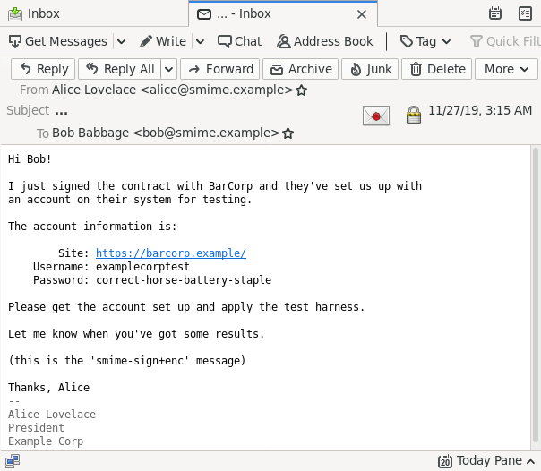
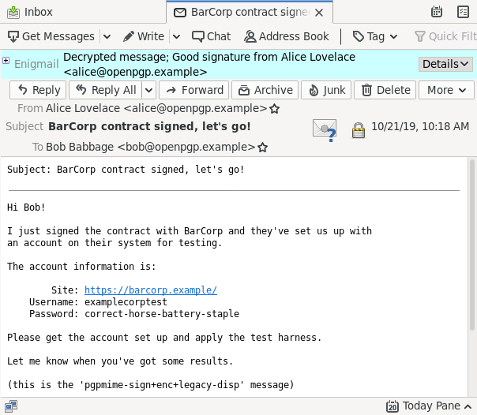
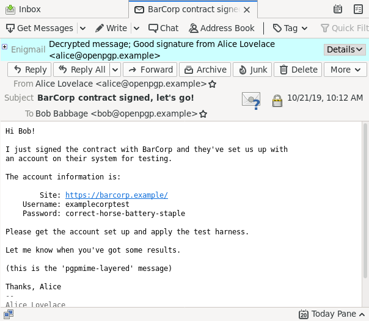
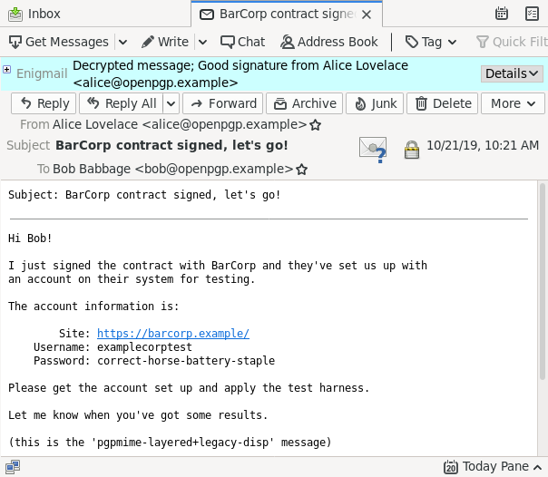
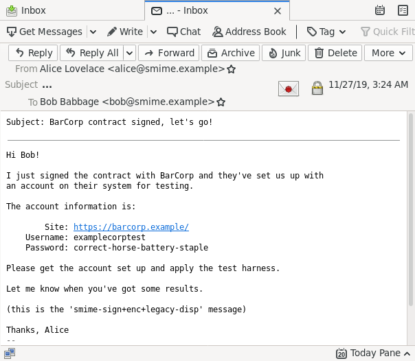
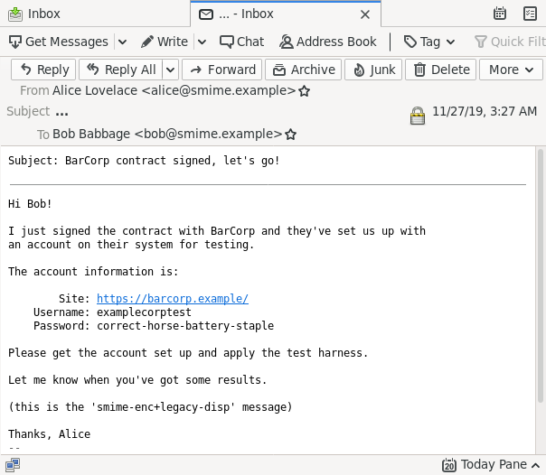
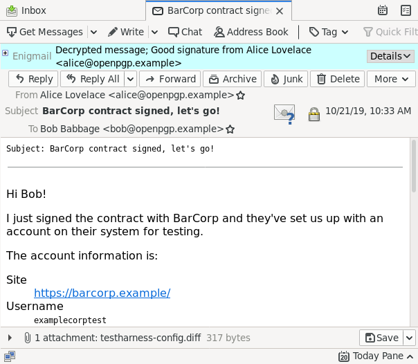

These Thunderbird/Enigmail screenshots were generated on a Debian
testing/unstable system on amd64, running X11.

~~~
$ dpkg -l enigmail thunderbird
Desired=Unknown/Install/Remove/Purge/Hold
| Status=Not/Inst/Conf-files/Unpacked/halF-conf/Half-inst/trig-aWait/Trig-pend
|/ Err?=(none)/Reinst-required (Status,Err: uppercase=bad)
||/ Name           Version       Architecture Description
+++-==============-=============-============-=================================
ii  enigmail       2:2.1.3+ds1-4 all          GPG support for Thunderbird and D
ii  thunderbird    1:68.3.1-1    amd64        mail/news client with RSS, chat a
$
~~~

See also the `distribution/thunderbird` script in this repository for
setup.

Samples:

 - `pgpmime-signed`

    

 - `smime-multipart-signed`

    

 - `smime-onepart-signed`

    

 - `pgpmime-sign+enc`

    

 - `smime-sign+enc`

    

 - `pgpmime-sign+enc+legacy-disp`

    

 - `pgpmime-layered`

    

 - `pgpmime-layered+legacy-disp`

    

 - `smime-sign+enc+legacy-disp`

    

 - `smime-enc+legacy-disp`

    

 - `pgpmime-enc+legacy-disp`

    

 - `unfortunately-complex`

    
